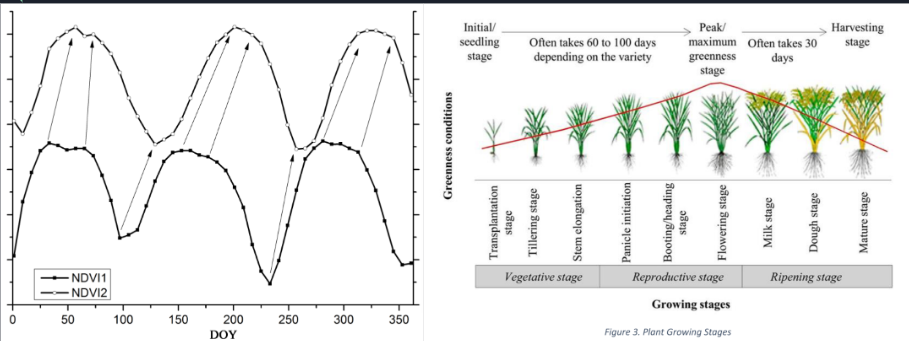
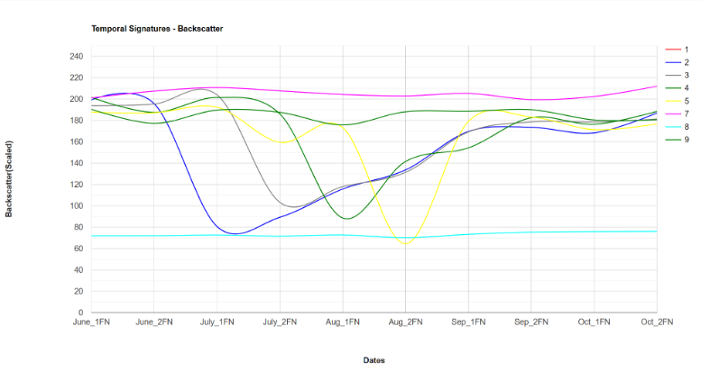
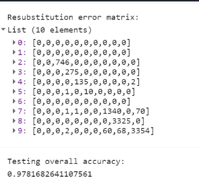

# Identifying Stages of Paddy Cultivation
## Overview
The "Identifying Stages of Paddy Cultivation" project, developed by Team ChadGPT, focuses on using satellite imagery and machine learning techniques to identify areas where paddy is being cultivated in Telangana, classify the paddy into various growth stages, and deploy a web application for viewing and interacting with these classified areas.

## Basic Idea
1. **Identification of Areas:** Utilize satellite data to extract datasets pinpointing areas where paddy cultivation is taking place in Telangana.
2. **Feature Extraction:** Capture satellite images at various wavelengths and extract features such as VV, VH, and NDVI to characterize the paddy cultivation stages.
3. **Annotation and Training:** Annotate training data and train classifiers, including random forest and deep learning models, to classify the paddy into different growth stages.
4. **Classifier Deployment:** Run the trained classifier on Telangana state to classify paddy growth stages.
5. **Future Work:** Explore the use of Generative AI to generate more annotated data, create datasets for training models for yield prediction, and develop a robust web application for farmers to analyze their lands and access yield predictions.

## Implementation Steps
1. Identification of areas where paddy is cultivated in Telangana.
2. Classification of paddy into various growth stages using satellite imagery.
3. Deployment of a web application to view and interact with classified areas.

## Normalized Difference Vegetation Index (NDVI)
The project leverages the Normalized Difference Vegetation Index (NDVI) as a crucial component for characterizing paddy cultivation stages using satellite imagery. NDVI, calculated from satellite data, provides valuable insights into vegetation health and density by measuring the difference between near-infrared (NIR) and visible red light reflected by vegetation. In our project, NDVI serves as a key feature for distinguishing between various growth stages of paddy cultivation, contributing to the accuracy of our classification algorithms.

## Results
We were able to get an accuracy of 97.2% on the test dataset using a Random Forest Classifier. The classifier was then deployed on the Telangana state to classify paddy growth stages.
 

## Web Application
The web application can be compiled and run using the following steps:
1. `cd dashboard`
2. `python3 Home.py`

## Here are some screenshots of the web application:

The different colors represent different growth stages of paddy cultivation.
The features of the web application include:
1. Zoom in and out
2. Filter by growth stage
3. Search for a specific region
4. Easy to use interface
5. LightWeight the whole data is loaded on the fly

## Future Work
1. Generative AI: Utilize Generative AI techniques to generate more annotated data for training.
2. Yield Prediction: Craft datasets and train models for yield prediction to aid farmers in decision-making.
3. Web Application Enhancement: Develop a user-friendly and robust web application where farmers can analyze their lands and access yield predictions.
